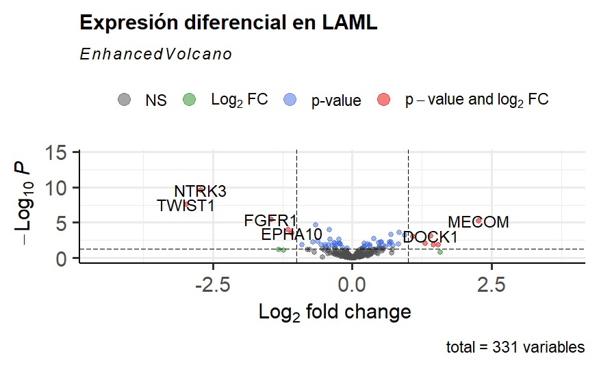

Domingo 09 de Febrero del 2025

*García González Carlos*

# Introducción

El **cáncer** se origina cuando las células en alguna parte del cuerpo comienzan a crecer sin control. Existen muchos tipos de cáncer. Las células en casi cualquier parte del cuerpo pueden convertirse en cáncer. 

Las **leucemias** son cánceres que se origina en las células que normalmente madurarían hacia los diferentes tipos de células sanguíneas. Con más frecuencia, la leucemia se origina en formas tempranas de glóbulos blancos, pero algunas leucemias comienzan en otros tipos de células sanguíneas. Existen varios tipos de leucemia que se dividen basándose principalmente en si la leucemia es **aguda** (rápido crecimiento) o **crónica** (crecimiento más lento), y si se inicia en células mieloides o células linfoides.

La **leucemia mieloide aguda** (**AML**, por sus siglas en inglés) se inicia en la médula ósea, pero con más frecuencia también pasa rápidamente a la sangre. Algunas veces se propaga a otras partes del cuerpo, incluyendo los ganglios linfáticos, el hígado, el bazo, el sistema nervioso central y los testículos.

# Análisi de los resultados obtenidos

El código utilizado para obtener los resultados puede ser consultado en el siguiente path:

``` {r}
 # Proyecto_Bioinformatica/Code/Analisis_expresion_diferencial.Rmd
```


### Data

Los datos de este análisis son del proyecto de 
[**Leucemia Mieloide Aguda (LAML)**](https://portal.gdc.cancer.gov/projects/TCGA-LAML)  provenientes de [**The Cancer Genome Atlas (TCGA)**](https://www.cancer.gov/ccg/research/genome-sequencing/tcga).

Dichos datos estaban constituidos por 178 muestras provinientes de diferentes pacientes, en los cuales se observo la expresión de 63 856 genes.

De esos 63 856 genes se selecciono un .50% de dichos genes, es decir 323 genes, los cuales se seleccionaron por su papel en la diferenciación de las células mieloides, siendo nuestro interes principal.

Para ver más a detalle los pasos que se siguieron y la estrategia de limpieza y normalización de datos, se puede consultar el código cuyo path se encuentra al inicio de esta sección.

### Resultados

Hablaremos más a detalle de los resultados obtenidos de tres graficas en concreto: Heatmap, MA plot y volcanoplot:


#### Volcanoplot
```{r, fig.align='center', fig.cap= "**Figura 1.** Volcano plot de los genes de diferenciación de células mieloides diferencialmente expresados en LAML.", echo=FALSE, out.width="100%"}


```


#### Hetmap

```{r, fig.align='center', fig.cap= "**Figura 2.** Heatmap de la expresión diferencial de genes en LAML. El color indica el nivel de expresión, con rojo para alta y azul para baja expresión.", echo=FALSE, out.width="100%"}


```


#### MA plot
```{r, fig.align='center', fig.cap= "**Figura 3.** MA plot de la expresión diferencial en LAML. Se muestra el log₂ del cambio de expresión frente a la media de cuentas normalizadas, destacando en azul los genes diferencialmente expresados.", echo=FALSE, out.width="100%"}


```

#### Box plot
Además de ver la expresión diferencial en general, se analizo un gen en particular, el cual fue **SPN**, quien codifíca para **CD43** ya que una alta expresión de este gen se asocia con la malignidad de los cánceres.

```{r, fig.align='center', fig.cap= "**Figura 4.** Distribución de la expresión del gen SPN según el estado vital de los individuos, con valores agrupados en categorías vivos y muertos diferencialmente expresados.", echo=FALSE, out.width="100%"}


```


#### PCA
Por ultímo se realizo un PCA en el análisis de expresión diferencial en LAML ya que es una estrategia útil porque nos permite reducir la dimensionalidad de los datos y visualizar su variabilidad de manera más comprensible. Esto facilita la identificación de posibles agrupaciones entre las muestras según su estado vital, lo que puede revelar diferencias biológicas relevantes.

```{r, fig.align='center', fig.cap= "**Figura 5.** Se muestra la distribución de las muestras en el espacio de los primeros dos componentes principales (PC1 y PC2), con los puntos coloreados según el estado vital de los individuos..", echo=FALSE, out.width="100%"}

knitr::include_graphics("../Plots/PCA_muestras.jpg")
```


#### Resultados Explicados


| **Gen** | **Producto**                                                          | **Función**                                                                                                                                                                                                                                                                     |
|---------|-----------------------------------------------------------------------|---------------------------------------------------------------------------------------------------------------------------------------------------------------------------------------------------------------------------------------------------------------------------------|
| SPN     | CD43                                                                  | CD43 es una glicoproteína transmembranal tipo I expresada por todas las células del sistema inmune.  Se ha encontrado la expresión del RNA mensajero de CD43 así como de la proteína en ciertos tipos de  tumores, en los que la expresión de CD43 correlaciona con malignidad. |
| NTRK3   | Proteínas de  fusión TR                                               | Participa en la fosforilación de los miembros de la ruta MAPK, además contribuye a la diferenciación celular y ayuda al desarrollo de las neuronas propioceptivas.                                                                                                              |
| FGFR1   | Proteína del receptor del  factor de crecimiento de  fibroblastos 1   | Esta proteína participa en la división celular, el desarrollo de tejidos, la formación de vasos  sanguíneos y la cicatrización de heridas.                                                                                                                                      |
| TWIST1  | Proteína 1 relacionada  con torsión                                   | Twist desempeña un papel esencial en la metástasis del cáncer. La sobreexpresión de Twist o  la metilación de su promotor es común en carcinomas metastásicos . Por lo tanto, la orientación de  Twist tiene una gran promesa como terapia contra el cáncer.                    |
| DOCK1   | Proteína dedicada a  la citocinesis 1                                 | Regula la migración celular y la fagocitosis                                                                                                                                                                                                                                    |
| MECOM   | Proteína que regula la  transcripción y que actúa  como oncoproteína. | Esta proteína participa en la hematopoyesis, la apoptosis, el desarrollo, la diferenciación y la  proliferación celular.                                                                                                                                                        |
| MYB     | No encontrado                                                         | Regula en forma positiva el crecimiento y la diferenciación celular.                                                                                                                                                                                                            |
| EPHA1   | EPH Receptor A1                                                       | Regula la morfología y la motilidad celular a través de la vía ILK-RhoA-ROCK                                                                                                                                                                                                    |
| GATA2   | Factor de Trancripción GATA2                                          | Regula la diferenciación de las células sanguíneas, la proliferación de las células hematopoyéticas  y la identidad de los mastocitos.                                                                                                                                          |
| RUNX1   | Codificá para ML1                                                     | Es un factor de transcripción que regula la expresión de genes relacionados con la hematopoyesis.                                                                                                                                                                               |
| ERG     | V-ets erythroblastosis  virus E26 oncogene homolog                    | Esencial para la homeostasis endotelial, ya que impulsa la expresión de genes de linaje y reprime  los genes proinflamatorios                                                                                                                                                   |
| CEBPA   | Proteína CCAAT/enhancer  binding proteína alfa                        | Diferenciación de los progenitores hematopoyéticos hacia el linaje mieloide maduro                                                                                                                                                                                              |
| SPI1    | Factor de Trancripción                                                | Codifica un factor de transcripción que regula la proliferación celular, la apoptosis y la  diferenciación de las células. Este gen es fundamental para el desarrollo de las células mieloides  y linfoides.                                                                    |
| FLI1    | Proteína FLI                                                          | Funciones en el desarrollo embriológico, la hematopoyesis y el crecimiento y diferenciación celular.                                                                                                                                                                            |


En la leucemia mieloide aguda (LMA), la sobreexpresión de ciertos genes está estrechamente relacionada con la desregulación de la hematopoyesis normal, lo que conduce a una proliferación incontrolada de células mieloides inmaduras en la médula ósea. Este fenómeno puede ocurrir por mutaciones en factores de transcripción clave, como RUNX1, SPI1 y GATA2, que regulan la diferenciación de las células hematopoyéticas. Cuando estos genes se sobreexpresan o presentan alteraciones en su función, pueden impedir la maduración celular normal y promover la acumulación de blastos inmaduros en la médula ósea y la sangre periférica. Adicionalmente, la sobreexpresión de genes oncogénicos como MEF2C o ERG puede favorecer la proliferación celular al activar vías de señalización que inhiben la apoptosis y promueven la supervivencia de las células leucémicas.

Otro mecanismo importante en la sobreexpresión de genes en la LMA es la activación anómala de vías de señalización intracelular, como la vía MAPK, ILK-RhoA-ROCK o las reguladas por receptores de tirosina quinasa como FGFR1 y NTRK3. Estas vías influyen en la proliferación, diferenciación y migración celular, y su activación descontrolada puede contribuir al desarrollo de la leucemia al mantener un estado proliferativo en las células inmaduras. Además, la metilación aberrante de promotores de genes supresores de tumores y la desregulación epigenética pueden favorecer la expresión excesiva de oncogenes como TWIST1, lo que facilita la resistencia a la apoptosis y la invasión de células leucémicas a otros tejidos. En conjunto, estos eventos conducen a la progresión de la LMA y dificultan la respuesta al tratamiento convencional.


## Referencias

- Recount 3
https://bioconductor.org/packages/release/bioc/html/recount3.html

- Bioconductor
https://bioconductor.org/

- TCGA-LAML project
https://bioconductor.org/